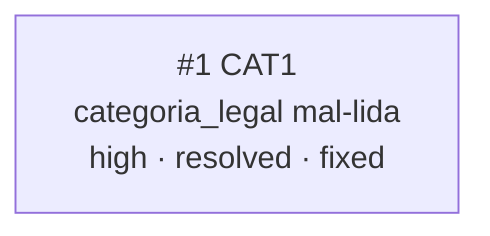

<!-- GENERATED, DO NOT EDIT: regenerado por /reversa-debugger-graph em 2026-07-23 a partir de 1 bug -->

# Grafo de Bugs — categorizacao-de-casos

## Clusters

Nenhum — único bug do contexto, sem relações.

## Impact score

CAT1: 0 (nenhuma relação registrada).
