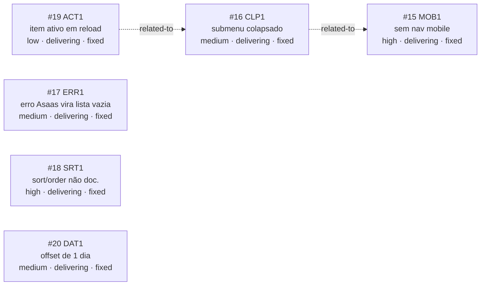

<!-- GENERATED, DO NOT EDIT: regenerado por /reversa-debugger-graph em 2026-07-23 a partir de 6 bugs -->

# Grafo de Bugs — configuracoes

## Clusters

Todos os 6 bugs foram corrigidos na mesma sessão de `/reversa-debugger-fix` (YOLO mode). `MOB1`/`CLP1`/`ACT1` (navegação do submenu) e `ERR1`/`SRT1`/`DAT1` (incerteza sobre a API da Asaas) permanecem como os dois clusters já identificados na varredura — as correções foram feitas por bug, sem refatoração ampla.

## Impact score

Todos os 6 bugs têm impact score 0 (arestas `proposed`).
