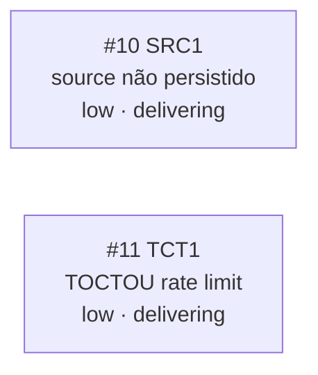

<!-- GENERATED, DO NOT EDIT: regenerado por /reversa-debugger-graph em 2026-07-22 a partir de 2 bugs -->

# Grafo de Bugs — insights-ia-dashboard

## Clusters

Nenhum cluster — os 2 bugs não compartilham arquivo afetado nem causa raiz (`SRC1` é campo não persistido em Firestore, `TCT1` é janela de corrida em transação). Ambos nasceram da mesma inspeção pós-`/reversa-coding` da feature 003, mas são defeitos independentes.
