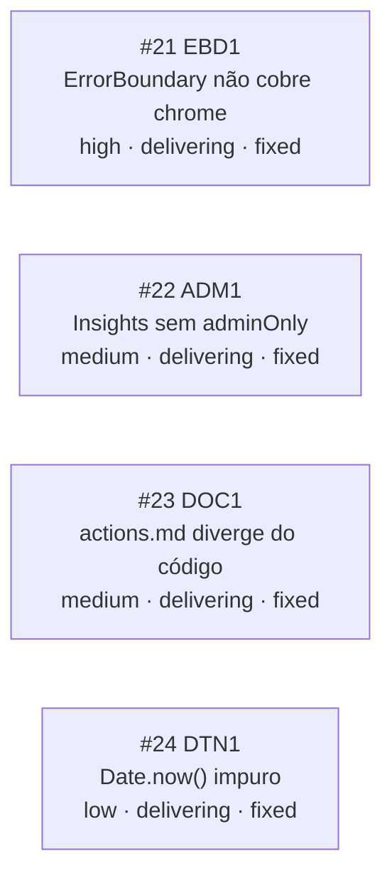

<!-- GENERATED, DO NOT EDIT: regenerado por /reversa-debugger-graph em 2026-07-23 a partir de 4 bugs -->

# Grafo de Bugs — limpeza-frontend

## Clusters

Nenhum cluster por causa raiz comum — os 4 bugs são independentes entre si, mesmo `ADM1`/`DTN1` mirando o mesmo arquivo (`insights/page.tsx`) por coincidência de alvo recém-exposto, não por causa compartilhada.

`EBD1` foi o de maior severidade (afeta o CHROME de toda página do dashboard) e o primeiro corrigido.

## Impact score

Todos os 4 bugs têm impact score 0 (nenhuma relação registrada). Ordem de correção seguida foi por `severity`/`priority`: `EBD1` (high/P1) → `ADM1` (medium/P2) → `DTN1` (low/P3, mesmo arquivo de `ADM1`, corrigido em sequência) → `DOC1` (medium/P2, correção textual).
