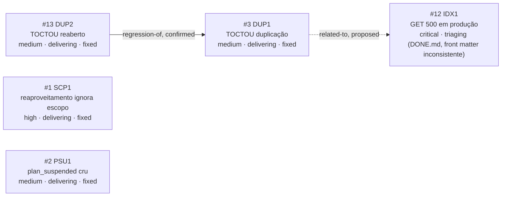

<!-- GENERATED, DO NOT EDIT: regenerado por /reversa-debugger-graph em 2026-07-23 a partir de 6 bugs (1 restricted omitido do grafo público) -->

# Grafo de Bugs — relatorios

## Clusters

**Cluster do incidente de produção**: `IDX1`, `DUP2` e o bug restrito (removido) nasceram da mesma resposta ao vivo ao incidente `IDX1`. `DUP2` foi corrigido nesta sessão — investigação concluiu que a remoção original da transação (motivada por suposta "incompatibilidade Vercel") não tinha sustentação real; a transação foi restaurada e validada (5/5 testes, incluindo concorrência real).

`SCP1` e `PSU1` seguem fechados e intactos.

## Impact score

`DUP2` mantém impact score elevado por conexão `confirmed` (`regression-of`) com `DUP1`. Demais em 0 (arestas `proposed`).
