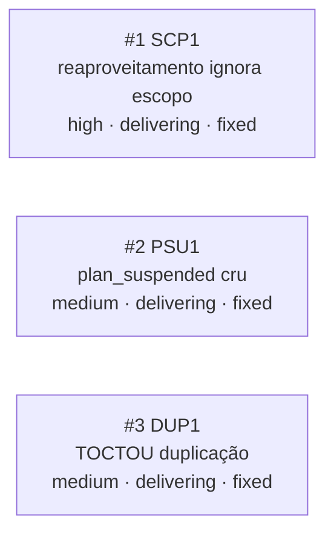

<!-- GENERATED, DO NOT EDIT: regenerado por /reversa-debugger-graph em 2026-07-23 a partir de 3 bugs -->

# Grafo de Bugs — relatorios

## Clusters

Nenhum cluster por arquivo/causa raiz comum: os 3 bugs nasceram da mesma inspeção pós-`/reversa-coding` da feature 005 (`varredura-01-pos-coding-005`) e foram corrigidos na mesma sessão de `/reversa-debugger-fix`, mas têm causas raiz independentes — `SCP1` é ausência de dado (GET não expunha escopo do filtro), `PSU1` é falta de tradução de código de erro, `DUP1` é ausência de dedupe server-side. Convergência de origem e de decisão de design (`D-02`, ver `SCP1`/`DUP1`), não de código.

## Impact score

Todos os 3 bugs têm impact score **0** — a única relação registrada (`DUP1 related-to BUG-20260722-TCT1`) está em estado `proposed`, que por regra nunca entra no cálculo de impact score nem em priorização automática.
