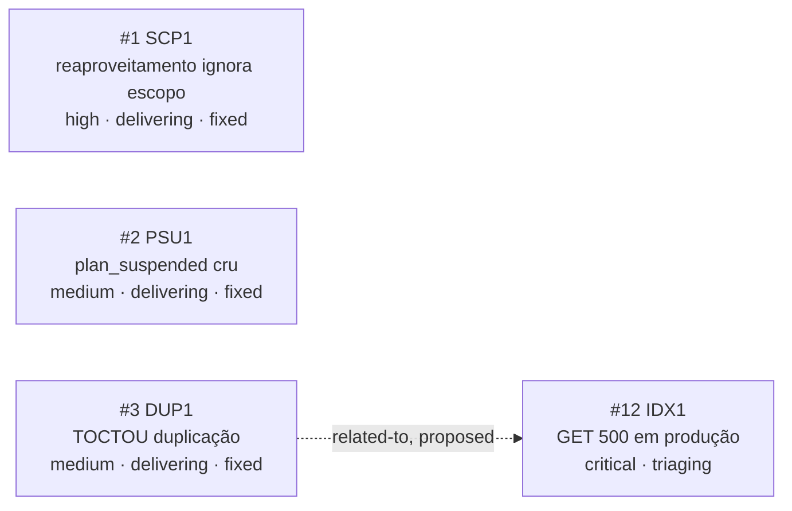

<!-- GENERATED, DO NOT EDIT: regenerado por /reversa-debugger-graph em 2026-07-23 a partir de 4 bugs -->

# Grafo de Bugs — relatorios

## Clusters

`SCP1`, `PSU1`, `DUP1` nasceram da mesma inspeção pós-`/reversa-coding` da feature 005 e foram corrigidos na mesma sessão, mas têm causas raiz independentes.

`IDX1` é um cluster à parte, urgente: é um relato direto do usuário em produção, aberto logo após a sessão de fix dos outros 3. A relação `related-to` com `DUP1` (proposed) marca a suspeita de que o mesmo deploy de índice Firestore que fechou o `DUP1` tenha causado o `IDX1` como efeito colateral — não são o mesmo defeito, mas compartilham o mesmo evento de infraestrutura como possível origem.

## Impact score

`SCP1`, `PSU1`, `DUP1` têm impact score **0**. `IDX1` também tem impact score de relações **0** (a única aresta que toca ele, `related-to` com `DUP1`, está em `proposed` — nunca conta pra impact score por regra), mas sua severidade `critical`/`P0` já basta pra priorização imediata independente de impact score estrutural.
