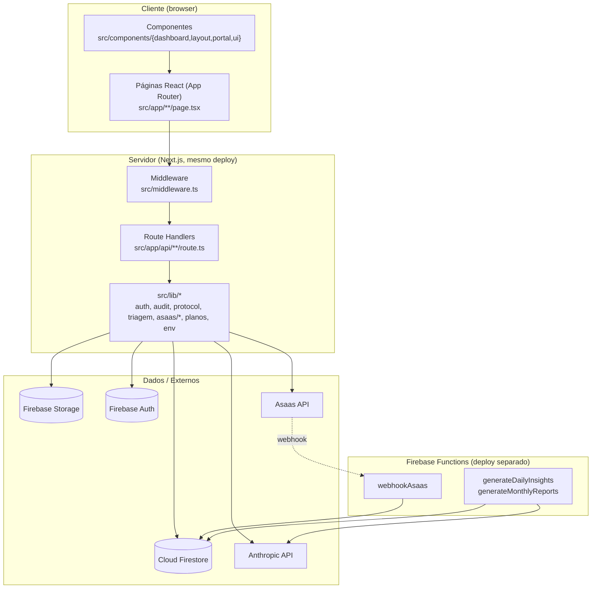

# Arquitetura — portal-sigilo

> Gerado pelo Architect em 2026-07-20. Síntese de `_reversa_sdd/{inventory,dependencies,code-analysis,data-dictionary,domain,state-machines,permissions}.md` e `.reversa/context/{surface,modules}.json`.
> Escala: 🟢 CONFIRMADO · 🟡 INFERIDO · 🔴 LACUNA
> Diagramas detalhados: `c4-context.md`, `c4-containers.md`, `c4-components.md`, `erd-complete.md`.

## Visão em uma frase

🟢 SaaS multi-tenant Next.js + Firebase que expõe um portal público anônimo de denúncias (com chatbot Claude de coleta e triagem automática) e um dashboard autenticado de gestão para compliance corporativo, com billing via Asaas e relatórios executivos gerados por IA.

## Estilo arquitetural

🟢 **Monolito modular server-rendered** (Next.js App Router): não há separação de "frontend" e "backend" como deploys distintos — Route Handlers e páginas React coexistem no mesmo build/processo. Um segundo container independente (Firebase Functions) cuida de jobs agendados e do webhook de pagamento, que precisam rodar fora do ciclo de vida de uma request HTTP normal do Next.js.

🟢 **Sem camada de serviço/domínio separada da camada HTTP**: a lógica de negócio vive diretamente nos Route Handlers (`src/app/api/**/route.ts`), com extração pontual para `src/lib/*` apenas quando reutilizada por mais de uma rota (`triagem.ts`, `protocol.ts`, `auth.ts`, `audit.ts`). Não há padrão de repositório/DTO — os Route Handlers falam diretamente com o Firestore via `adminDb`.

## Camadas

## Como o sistema resolve seus requisitos centrais

| Requisito | Como é resolvido | Onde |
|---|---|---|
| Anonimato do denunciante | Sem conta para denunciante; protocolo opaco; consulta pública nunca revela existência/conteúdo | `cases/track`, `messages`, `domain.md` |
| Multi-tenant | `org_id` em todo documento + filtro em toda query + Firestore Rules | `firestore.rules`, todas as rotas |
| Triagem inteligente | Claude classifica categoria/urgência/lei aplicável com validação estrita de schema | `lib/triagem.ts` |
| Gate de features por plano | Checagem de `session.plano`/`role` no servidor em cada rota relevante | `assistant`, `reports/generate`, `dashboard/users`, `dashboard/insights` |
| Cobrança recorrente | Asaas (link de pagamento) + webhook para ciclo de vida da assinatura | `checkout/create`, `billing/*`, `functions/webhookAsaas.ts` |
| Auditoria legal imutável | Coleção `audit_logs` com Rules bloqueando update/delete + `logAudit` best-effort | `lib/utils/audit.ts`, `firestore.rules` |
| Relatório executivo | Agregação de métricas + Claude + máquina de estados de aprovação + export PDF | `reports/*`, `pdf-lib` |

## Riscos arquiteturais mais relevantes (consolidado do Detective + Architect)

1. 🔴 **Sem testes automatizados de aplicação** — só há teste de Firestore Rules (`scripts/test-rules.ts`). Toda a lógica de negócio (triagem, billing, relatórios, permissões nos Route Handlers) depende de revisão manual.
2. 🟡 **Autorização duplicada e não sincronizada** entre Firestore Rules e Route Handlers (ADR-005) — já existe pelo menos uma divergência confirmada (`assistant` não bloqueia `auditor` explicitamente).
3. 🟡 **Sem CI/CD** — deploy manual em dois lugares (Next.js app + Firebase Functions), sem gate automatizado antes de produção.
4. 🟡 **Drift de dependências e de modelo de IA** entre app raiz e `functions/` (ver `dependencies.md`, `c4-components.md`).
5. 🔴 **Ciclo de vida de plano incompleto**: sem rota de upgrade/downgrade nem de reativação pós-suspensão encontrada, apesar de existir story (`9.6`) e menções de UI (`Alterar Plano`) — ver `state-machines.md`.
6. 🔴 **Divergência entre `docs/SECURITY.md` (S7/S8) e implementação real**: limites de anexo por caso e criptografia de campo documentados não encontrados no código — ver `domain.md`.

## Ver também

- `_reversa_sdd/c4-context.md`, `c4-containers.md`, `c4-components.md` — diagramas C4
- `_reversa_sdd/erd-complete.md` — modelo de dados completo
- `_reversa_sdd/traceability/spec-impact-matrix.md` — matriz de impacto
- `_reversa_sdd/domain.md`, `state-machines.md`, `permissions.md` — conhecimento de negócio (Detective)
- `_reversa_sdd/adrs/*.md` — decisões arquiteturais retroativas
