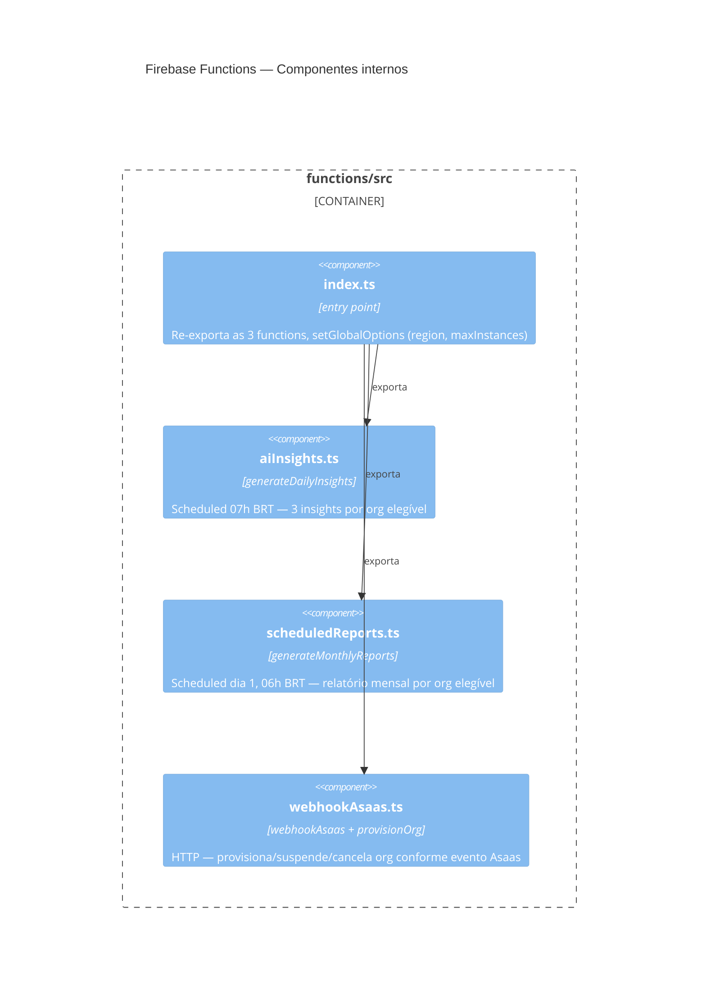

# C4 — Nível 3: Componentes — portal-sigilo

> Gerado pelo Architect em 2026-07-20. Foco nos containers mais relevantes: **Route Handlers** e **Firebase Functions**.
> Escala: 🟢 CONFIRMADO · 🟡 INFERIDO · 🔴 LACUNA

## Componentes do container "Route Handlers"

```mermaid
C4Component
    title Route Handlers — Componentes internos

    Container_Boundary(routeHandlers, "Route Handlers (src/app/api)") {
        Component(authComp, "auth", "login/logout/me", "Sessão via Firebase session cookie")
        Component(casesComp, "cases", "cases/resolve/track", "Criação formulário + consulta pública de status")
        Component(chatComp, "chat", "chat", "Chatbot Claude de coleta + criação de caso + disparo de triagem")
        Component(assistantComp, "assistant", "assistant", "Assistente Claude para gestor, streaming SSE")
        Component(dashboardComp, "dashboard", "12 rotas", "Núcleo do painel: casos, métricas, heatmap, insights, org, users")
        Component(billingComp, "billing", "info/subscription/invoices/cancel", "Consulta e cancelamento de assinatura")
        Component(checkoutComp, "checkout", "checkout/create", "Geração de link de pagamento")
        Component(reportsComp, "reports", "generate/[id]/approve/export", "Relatório executivo com máquina de estados")
        Component(messagesComp, "messages", "messages", "Mensagens do denunciante (canal público)")
        Component(orgsComp, "orgs", "orgs/search", "Busca de org por nome")
        Component(uploadComp, "upload-attachment", "upload-attachment", "Upload validado de anexos")
    }

    Component(authLib, "lib/utils/auth.ts", "verifySession", "Decodifica cookie + valida ativo=true")
    Component(auditLib, "lib/utils/audit.ts", "logAudit", "Grava audit_logs, nunca lança exceção")
    Component(protocolLib, "lib/utils/protocol.ts", "generateProtocol", "Gera protocolo único com retry de colisão")
    Component(triagemLib, "lib/triagem.ts", "runTriagem", "Classificação por IA com validação estrita")
    Component(asaasLib, "lib/asaas/*", "createPaymentLink, getSubscription, getInvoices, cancelSubscription", "Cliente HTTP direto da API Asaas")
    Component(planosLib, "lib/planos.ts", "PLANOS", "Config estática de planos/preços/features")
    Component(envLib, "lib/env.ts", "requireEnv", "Variáveis de ambiente server-only")
    Component(adminLib, "lib/firebase-admin/admin.ts", "adminDb/adminAuth/adminStorage", "Inicialização idempotente do Admin SDK")

    Rel(authComp, authLib, "usa")
    Rel(casesComp, protocolLib, "usa")
    Rel(chatComp, protocolLib, "usa")
    Rel(chatComp, triagemLib, "dispara")
    Rel(dashboardComp, authLib, "usa")
    Rel(billingComp, authLib, "usa")
    Rel(billingComp, asaasLib, "usa")
    Rel(checkoutComp, asaasLib, "usa")
    Rel(reportsComp, authLib, "usa")
    Rel(assistantComp, authLib, "usa")
    Rel(uploadComp, adminLib, "usa (Storage)")

    Rel(authComp, auditLib, "grava eventos")
    Rel(dashboardComp, auditLib, "grava eventos")
    Rel(billingComp, auditLib, "grava eventos")
    Rel(reportsComp, auditLib, "grava eventos")
    Rel(chatComp, auditLib, "grava eventos")
    Rel(uploadComp, auditLib, "grava eventos")

    Rel(authLib, adminLib, "usa")
    Rel(auditLib, adminLib, "usa")
    Rel(protocolLib, adminLib, "usa")
    Rel(triagemLib, adminLib, "usa")
    Rel(adminLib, envLib, "lê credenciais")
    Rel(asaasLib, envLib, "lê ASAAS_API_KEY/BASE_URL")
```

### Componentes compartilhados mais usados (fan-in)

| Componente | Usado por | Papel |
|---|---|---|
| `verifySession` (`lib/utils/auth.ts`) | auth, cases (dashboard), chat (indireto via case), assistant, billing, dashboard (todas as 12 rotas), reports | Ponto único de verificação de identidade — mudança aqui afeta praticamente todo o sistema autenticado |
| `logAudit` (`lib/utils/audit.ts`) | auth, dashboard, billing, reports, chat, upload-attachment | Trilha de auditoria transversal |
| `adminDb`/`adminAuth`/`adminStorage` (`lib/firebase-admin/admin.ts`) | todos os componentes acima | Acesso a dados — único ponto de inicialização do Admin SDK |

## Componentes do container "Firebase Functions"

🟡 **Nota de acoplamento:** `aiInsights.ts` e `scheduledReports.ts` duplicam a mesma lógica de agregação de métricas de casos (categorias, leis, resolvidos/pendentes, prazo médio) que também existe em `src/app/api/reports/generate/route.ts` — três implementações independentes do mesmo algoritmo de agregação, uma no app Next.js e duas nas Functions (dívida técnica, ver seção abaixo).

## Dívidas técnicas identificadas

| # | Dívida | Local | Severidade (inferida) |
|---|---|---|---|
| 1 | Algoritmo de agregação de métricas de relatório duplicado 3x (`reports/generate`, `scheduledReports.ts`, e parcialmente `dashboard/metrics`) | ver acima | 🟡 média — risco de divergência de lógica entre geração manual e agendada |
| 2 | Lógica de streaming SSE (`ReadableStream`+`encoder`+`emit`) duplicada entre `chat/route.ts` e `assistant/route.ts` | `src/app/api/chat/route.ts`, `src/app/api/assistant/route.ts` | 🟢 baixa — duplicação pequena, isolada |
| 3 | Checagem de acesso a caso (org_id + mencionados) reimplementada em cada rota de `dashboard/cases/*`, com apenas uma extração local (`checkCaseAccess`) | `src/app/api/dashboard/cases/**` | 🟡 média — risco de uma rota nova esquecer a checagem (ver ADR-005) |
| 4 | Ausência de testes automatizados de aplicação (só há teste de Firestore Rules) | todo `src/app/api`, `src/lib` | 🔴 alta — nenhuma rede de segurança para regressão de lógica de negócio |
| 5 | Drift de versões entre app raiz e `functions/` (`firebase-admin`, `@anthropic-ai/sdk`, `eslint`, Node runtime) | ver `_reversa_sdd/dependencies.md` | 🟡 média |
| 6 | Modelo Claude hardcoded e inconsistente entre chamadas (`claude-sonnet-4-20250514` vs `claude-sonnet-4-6`), sem constante central | `assistant/route.ts`, `chat/route.ts`, `triagem.ts`, `reports/generate/route.ts`, `aiInsights.ts`, `scheduledReports.ts` | 🟡 média — dificulta upgrade coordenado de modelo |
| 7 | Divergências tipo↔dado no domínio (`categoria_legal` vs `categoria`, `updated_at`, `coleta_ia`, `triagem_manual` ausentes do tipo `Case`) | ver `_reversa_sdd/data-dictionary.md` | 🟡 média — risco de erro de tipagem silencioso |
| 8 | Ausência de CI/CD (`.github/workflows/` vazio) | raiz do repositório | 🟡 média — deploy manual, sem gate automatizado de lint/test/build antes de produção |
| 9 | `orgs/search` não escala (busca em memória sobre até 100 docs) | `src/app/api/orgs/search/route.ts` | 🟢 baixa hoje, cresce com número de tenants |
