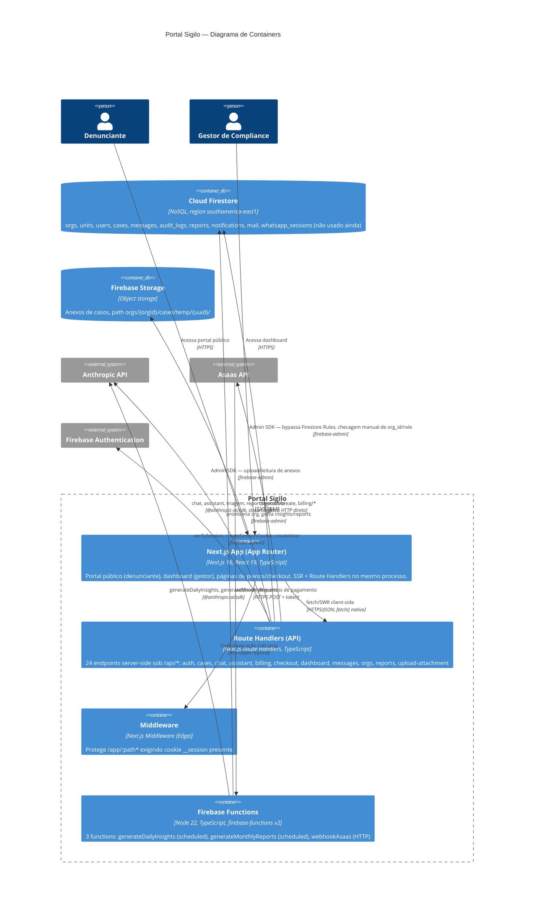

# C4 — Nível 2: Containers — portal-sigilo

> Gerado pelo Architect em 2026-07-20. Escala: 🟢 CONFIRMADO · 🟡 INFERIDO · 🔴 LACUNA

## Containers identificados

| Container | Tecnologia | Responsabilidade | Confiança |
|---|---|---|---|
| Next.js App (App Router) | Next.js 16, React 19 | Renderização de páginas (portal público, dashboard, planos), roteamento por convenção de pastas | 🟢 |
| Route Handlers | Next.js Route Handlers | 24 endpoints server-side, toda a lógica de negócio e integrações externas | 🟢 |
| Middleware | Next.js Middleware | Gate de presença de cookie de sessão para `/app/*` | 🟢 |
| Firebase Functions | Node 22 + firebase-functions v2 | Jobs agendados (insights diários, relatórios mensais) e webhook de pagamento — processo **separado** do Next.js, deploy independente via `firebase deploy --only functions` | 🟢 |
| Cloud Firestore | NoSQL gerenciado | Único banco de dados do sistema, multi-tenant | 🟢 |
| Firebase Storage | Object storage gerenciado | Anexos de casos | 🟢 |

🟡 **Nota de deployment:** não há Dockerfile/docker-compose no repositório — o Next.js app é hospedado presumivelmente em uma plataforma que builda `next build`/`next start` diretamente (Vercel ou similar), e as Functions são deployadas separadamente via Firebase CLI (`firebase.json` define `predeploy: [lint, build]`). Sem workflow de CI/CD (`.github/workflows/`) encontrado — deploy parece ser manual em ambos os containers. 🔴 Confirmação da plataforma de hosting do Next.js é uma LACUNA (não há `vercel.json` nem outro indicador explícito no repositório).

## Comunicação entre containers

- **webapp → routeHandlers**: mesmo processo/deploy (Next.js unifica ambos), comunicação via `fetch`/SWR client-side, não há chamada de rede externa real entre eles
- **routeHandlers → Firestore/Storage/Auth**: sempre via Firebase Admin SDK, nunca client SDK — implica bypass total das Firestore Rules (ver ADR-005)
- **asaas → functions**: único ponto de entrada HTTP externo que não passa pelo Next.js — a function `webhookAsaas` é uma Cloud Function HTTP independente, com autenticação própria via header `asaas-access-token`
- **functions → Firestore/Anthropic**: mesmo padrão de Admin SDK das Route Handlers, mas em processo/deploy separado (`functions/` tem seu próprio `package.json`, dependências e versões — ver drift documentado em `_reversa_sdd/dependencies.md`)
