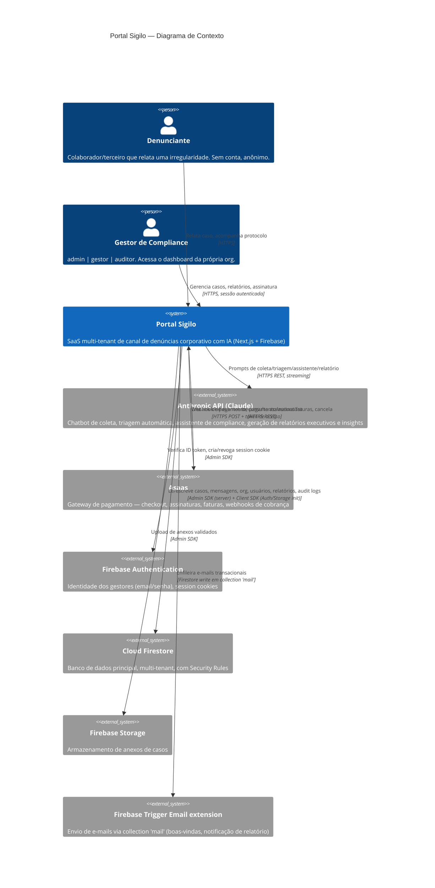

# C4 — Nível 1: Contexto — portal-sigilo

> Gerado pelo Architect em 2026-07-20. Escala: 🟢 CONFIRMADO · 🟡 INFERIDO · 🔴 LACUNA

## Personas

| Persona | Papel | Autenticação |
|---|---|---|
| Denunciante | Relata e acompanha um caso | 🟢 Nenhuma — acesso anônimo via protocolo (`ETK-YYYY-XXXXXX`) |
| Gestor `admin` | Administra org, usuários, billing, aprova relatórios | 🟢 Firebase Auth + session cookie |
| Gestor `gestor` | Gerencia casos, gera/aprova/exporta relatórios | 🟢 Firebase Auth + session cookie |
| Gestor `auditor` | Acesso predominantemente leitura (ver `_reversa_sdd/permissions.md`) | 🟢 Firebase Auth + session cookie |

## Sistemas externos

| Sistema | Papel | Confiança |
|---|---|---|
| Anthropic API (Claude) | 4 pontos de integração: chat de coleta, triagem automática, assistente do gestor, geração de relatórios/insights | 🟢 confirmado, 4 chamadas distintas no código |
| Asaas | Checkout, assinatura, faturas, cancelamento, webhook de provisionamento | 🟢 confirmado |
| Firebase Auth/Firestore/Storage | Identidade, banco de dados, armazenamento de arquivos | 🟢 confirmado |
| Firebase Trigger Email extension | Envio de e-mail transacional | 🟡 inferido — coleção `mail` é usada, mas a extensão em si não está configurada em nenhum arquivo lido (`firebase.json` não lista extensions) |

🔴 **LACUNA:** WhatsApp (Fase 7) e app mobile (Fase 8) aparecem no domínio (`WhatsappSession`, `CanalOrigem` incluindo `whatsapp`/`app`/`0800`) mas não têm integração externa implementada — não aparecem neste diagrama de contexto como sistemas ativos.
