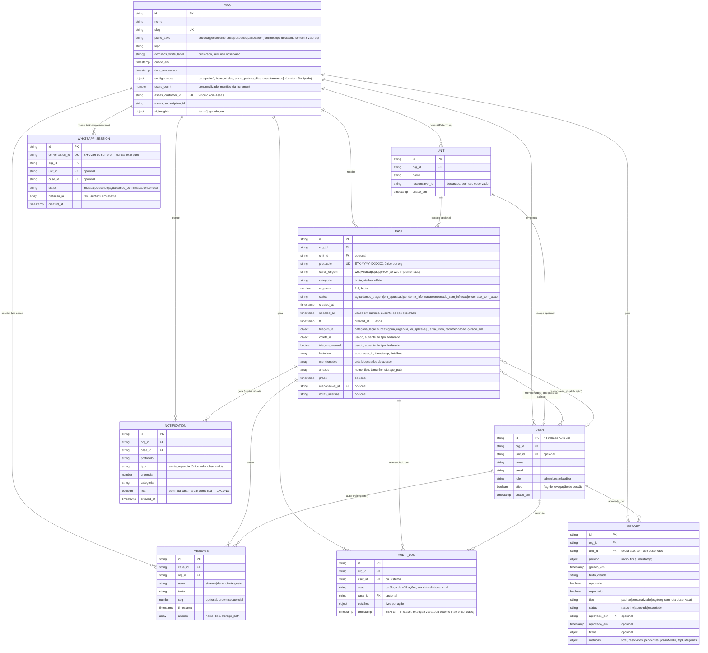

# ERD Completo — portal-sigilo

> Gerado pelo Architect em 2026-07-20. Banco Firestore (NoSQL) — cardinalidades inferidas do uso de `org_id`/`case_id` como chave de referência, não de FKs reais (Firestore não impõe integridade referencial).
> Escala: 🟢 CONFIRMADO · 🟡 INFERIDO · 🔴 LACUNA

## Notas sobre cardinalidade e integridade referencial

🟡 Firestore **não impõe** nenhuma das relações acima em nível de banco — todas as "chaves estrangeiras" (`org_id`, `case_id`, `unit_id`, `responsavel_id`, `aprovado_por`) são strings livres, validadas (quando validadas) apenas na camada de aplicação:
- `org_id` em `cases`/`messages`: validado em toda escrita relevante (ex.: `POST /api/messages` confere `caseDoc.data().org_id === org_id`)
- `unit_id` em `cases`: aceito sem validar que a unidade existe (`POST /api/cases`, `POST /api/chat` não verificam `units/{unit_id}` antes de gravar — só `chat` lê a unidade para personalizar o prompt, mas não bloqueia se não existir)
- `mencionados[]`/`responsavel_id` em `cases`: `mencionados` é validado contra `users` da mesma org só em `POST mencionados`; `responsavel_id` não parece ser validado contra `users` existentes no PATCH de caso (🔴 LACUNA — pode-se atribuir um `responsavel_id` inexistente)
- `whatsapp_sessions` não tem nenhuma rota de escrita observada — a entidade existe só como tipo TypeScript, não há dado real (🔴 confirmado como não implementado)

## Relação N:M explícita

`CASE.mencionados[]` é a única relação N:M do domínio: um caso pode mencionar vários usuários, e um usuário pode estar mencionado em vários casos. É modelada como array de IDs dentro do documento `case` (padrão comum em NoSQL), não como coleção de junção.
