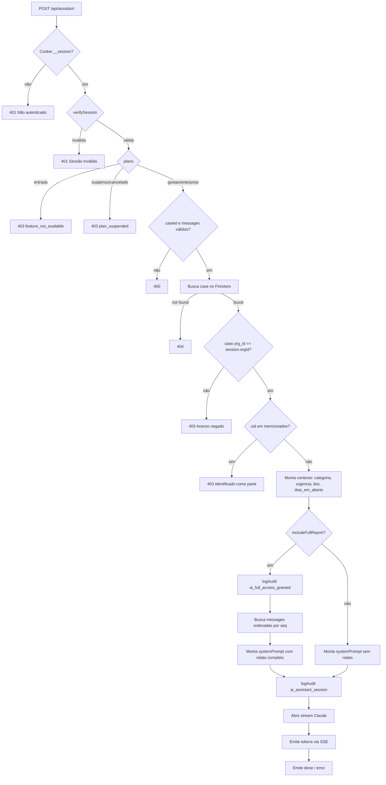
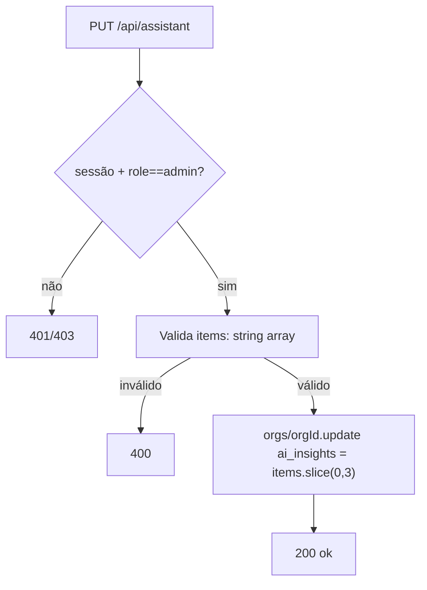

# Fluxograma — assistant

```mermaid
flowchart TD
    A[POST /api/assistant] --> B{Cookie __session?}
    B -- não --> B1[401 Não autenticado]
    B -- sim --> C{verifySession}
    C -- inválida --> C1[401 Sessão inválida]
    C -- válida --> D{plano}
    D -- entrada --> D1[403 feature_not_available]
    D -- suspenso/cancelado --> D2[403 plan_suspended]
    D -- gestao/enterprise --> E{caseId e messages válidos?}
    E -- não --> E1[400]
    E -- sim --> F[Busca case no Firestore]
    F -- not found --> F1[404]
    F -- found --> G{case.org_id == session.orgId?}
    G -- não --> G1[403 Acesso negado]
    G -- sim --> H{uid em mencionados?}
    H -- sim --> H1[403 identificado como parte]
    H -- não --> I[Monta contexto: categoria, urgencia, leis, dias_em_aberto]
    I --> J{includeFullReport?}
    J -- sim --> K[logAudit ai_full_access_granted]
    K --> L[Busca messages ordenadas por seq]
    L --> M[Monta systemPrompt com relato completo]
    J -- não --> M2[Monta systemPrompt sem relato]
    M --> N[logAudit ai_assistant_session]
    M2 --> N
    N --> O[Abre stream Claude]
    O --> P[Emite tokens via SSE]
    P --> Q[Emite done / error]
```

## PUT /api/assistant (interno)

```mermaid
flowchart TD
    A[PUT /api/assistant] --> B{sessão + role==admin?}
    B -- não --> B1[401/403]
    B -- sim --> C[Valida items: string array]
    C -- inválido --> C1[400]
    C -- válido --> D["orgs/orgId.update ai_insights = items.slice(0,3)"]
    D --> E[200 ok]
```
