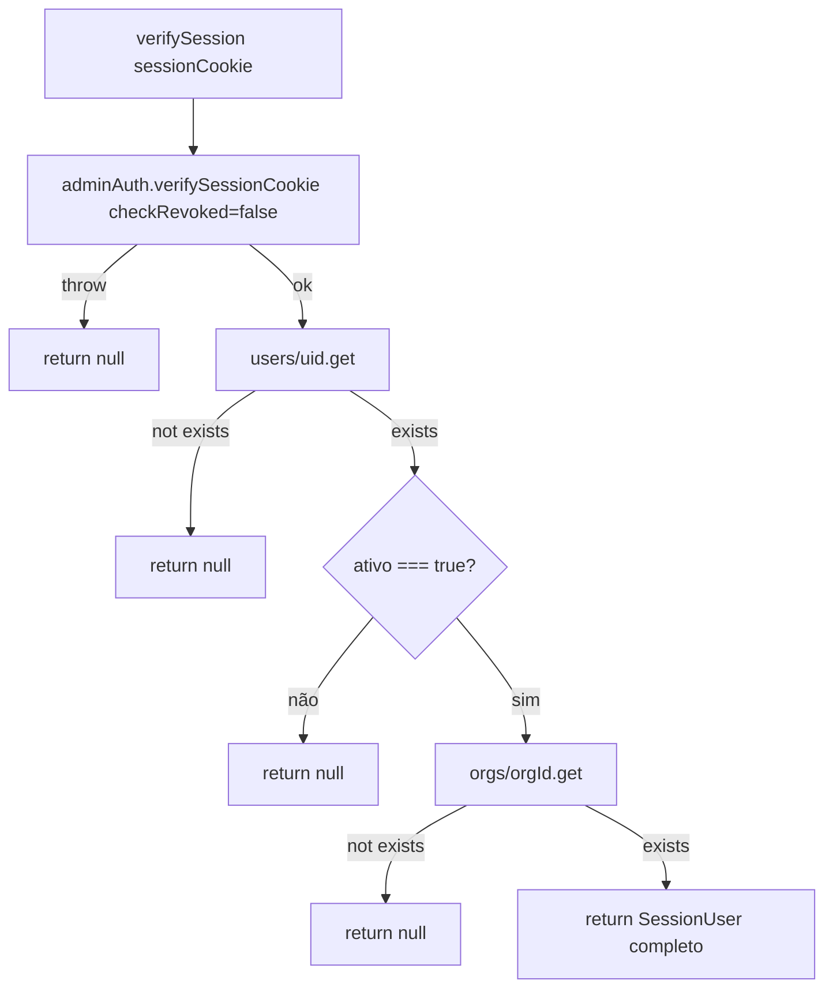

# Fluxograma — auth

```mermaid
flowchart TD
    subgraph LOGIN[POST /api/auth/login]
        A1[Recebe idToken] --> A2[adminAuth.verifyIdToken]
        A2 -- inválido --> A3[401 Token inválido]
        A2 -- válido --> A4[adminAuth.createSessionCookie 5 dias]
        A4 --> A5[verifySession best-effort]
        A5 --> A6[logAudit user_login não-crítico]
        A6 --> A7["Set-Cookie __session HttpOnly Secure SameSite=Strict"]
        A7 --> A8[200 ok]
    end

    subgraph LOGOUT[POST /api/auth/logout]
        B1[Lê cookie __session] --> B2{sessão válida?}
        B2 -- sim --> B3[logAudit user_logout]
        B3 --> B4[adminAuth.revokeRefreshTokens uid]
        B2 -- não/erro --> B5[Ignora, segue]
        B4 --> B6[Limpa cookie Max-Age=0]
        B5 --> B6
        B6 --> B7[200 ok sempre]
    end

    subgraph ME[GET /api/auth/me]
        C1[Lê cookie] --> C2{verifySession}
        C2 -- null --> C3[401]
        C2 -- ok --> C4[200 SessionUser]
    end
```

## verifySession (src/lib/utils/auth.ts)

```mermaid
flowchart TD
    A[verifySession sessionCookie] --> B[adminAuth.verifySessionCookie checkRevoked=false]
    B -- throw --> B1[return null]
    B -- ok --> C[users/uid.get]
    C -- not exists --> C1[return null]
    C -- exists --> D{ativo === true?}
    D -- não --> D1[return null]
    D -- sim --> E[orgs/orgId.get]
    E -- not exists --> E1[return null]
    E -- exists --> F[return SessionUser completo]
```
