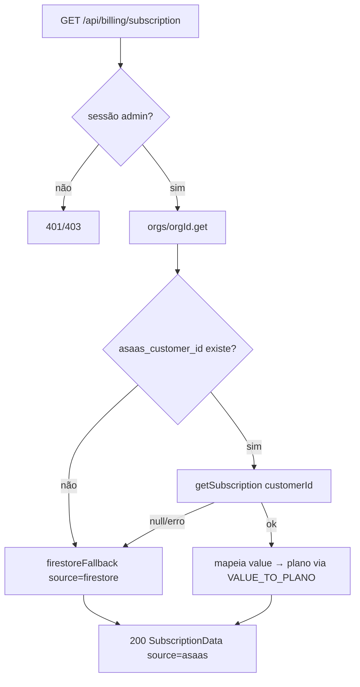
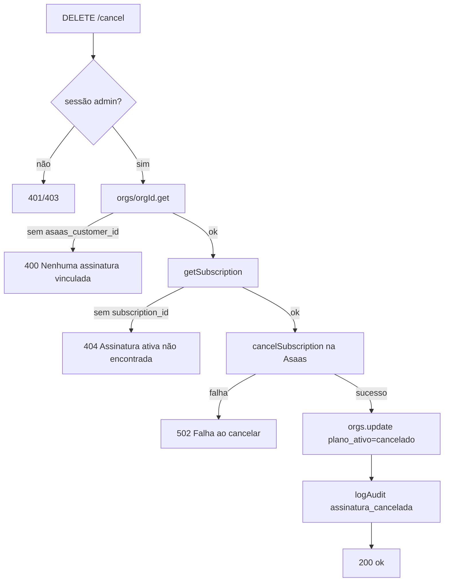

# Fluxograma — billing

```mermaid
flowchart TD
    A[GET /api/billing/subscription] --> B{sessão admin?}
    B -- não --> B1[401/403]
    B -- sim --> C[orgs/orgId.get]
    C --> D{asaas_customer_id existe?}
    D -- não --> E[firestoreFallback source=firestore]
    D -- sim --> F[getSubscription customerId]
    F -- null/erro --> E
    F -- ok --> G["mapeia value → plano via VALUE_TO_PLANO"]
    G --> H[200 SubscriptionData source=asaas]
    E --> H
```

## DELETE /api/billing/cancel

```mermaid
flowchart TD
    A[DELETE /cancel] --> B{sessão admin?}
    B -- não --> B1[401/403]
    B -- sim --> C[orgs/orgId.get]
    C -- sem asaas_customer_id --> C1[400 Nenhuma assinatura vinculada]
    C -- ok --> D[getSubscription]
    D -- sem subscription_id --> D1[404 Assinatura ativa não encontrada]
    D -- ok --> E[cancelSubscription na Asaas]
    E -- falha --> E1[502 Falha ao cancelar]
    E -- sucesso --> F["orgs.update plano_ativo=cancelado"]
    F --> G[logAudit assinatura_cancelada]
    G --> H[200 ok]
```
