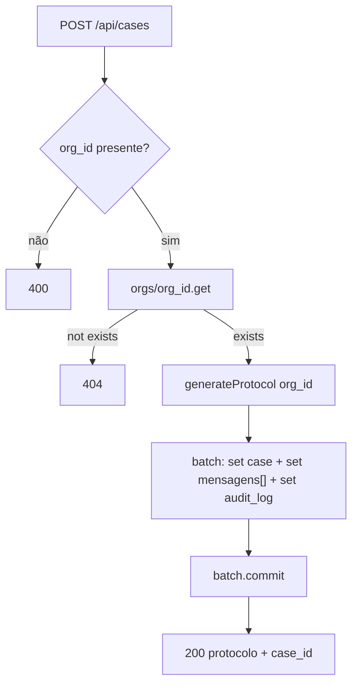
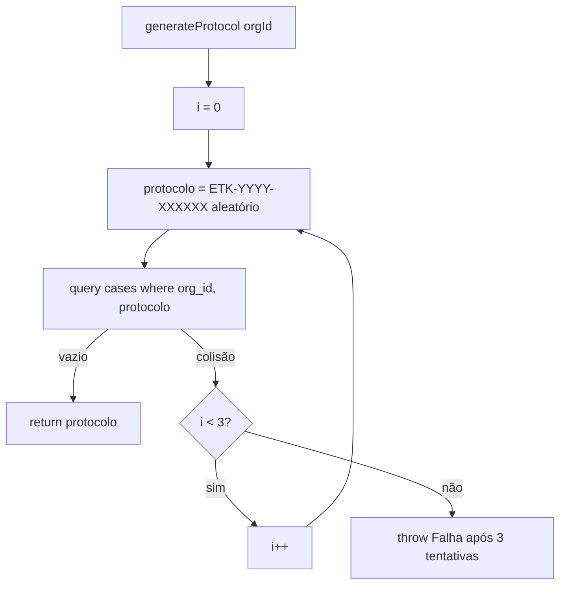
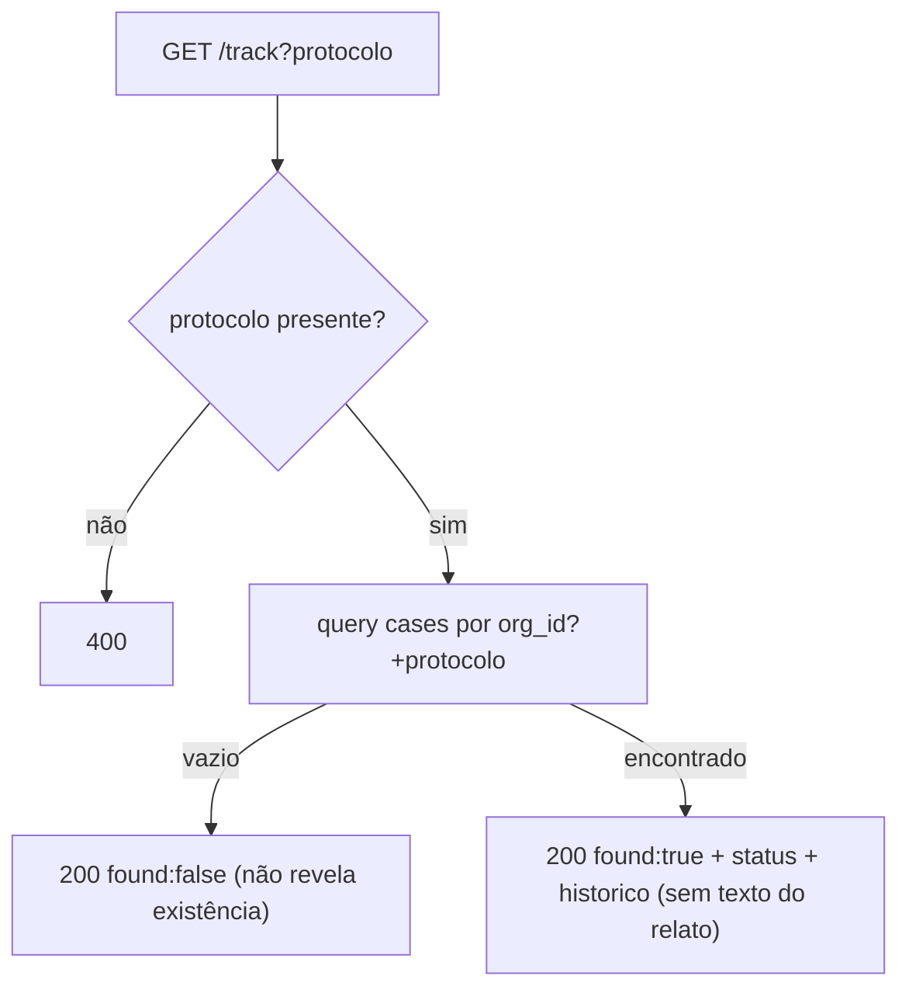

# Fluxograma — cases

```mermaid
flowchart TD
    A[POST /api/cases] --> B{org_id presente?}
    B -- não --> B1[400]
    B -- sim --> C[orgs/org_id.get]
    C -- not exists --> C1[404]
    C -- exists --> D[generateProtocol org_id]
    D --> E["batch: set case + set mensagens[] + set audit_log"]
    E --> F[batch.commit]
    F --> G[200 protocolo + case_id]
```

## generateProtocol (retry de colisão)

```mermaid
flowchart TD
    A[generateProtocol orgId] --> B[i = 0]
    B --> C["protocolo = ETK-YYYY-XXXXXX aleatório"]
    C --> D["query cases where org_id, protocolo"]
    D -- vazio --> E[return protocolo]
    D -- colisão --> F{i < 3?}
    F -- sim --> G[i++] --> C
    F -- não --> H[throw Falha após 3 tentativas]
```

## GET /api/cases/track (consulta pública)

```mermaid
flowchart TD
    A[GET /track?protocolo] --> B{protocolo presente?}
    B -- não --> B1[400]
    B -- sim --> C["query cases por org_id?+protocolo"]
    C -- vazio --> D["200 found:false (não revela existência)"]
    C -- encontrado --> E["200 found:true + status + historico (sem texto do relato)"]
```
