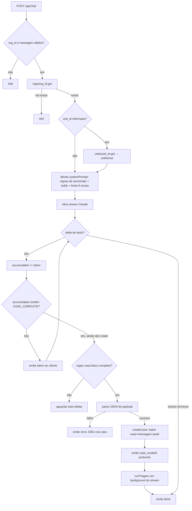
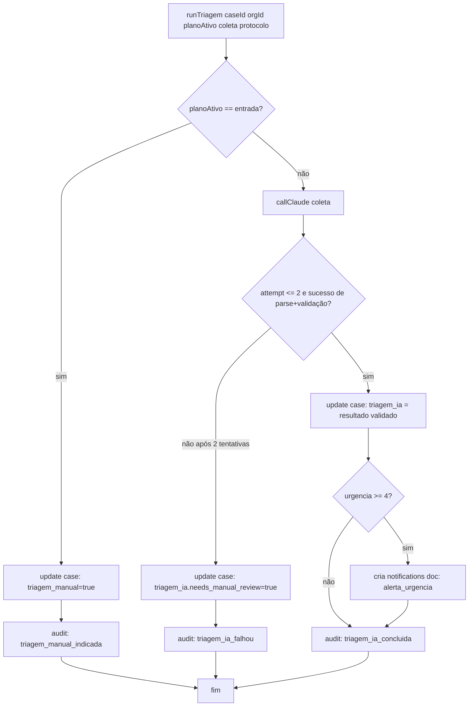
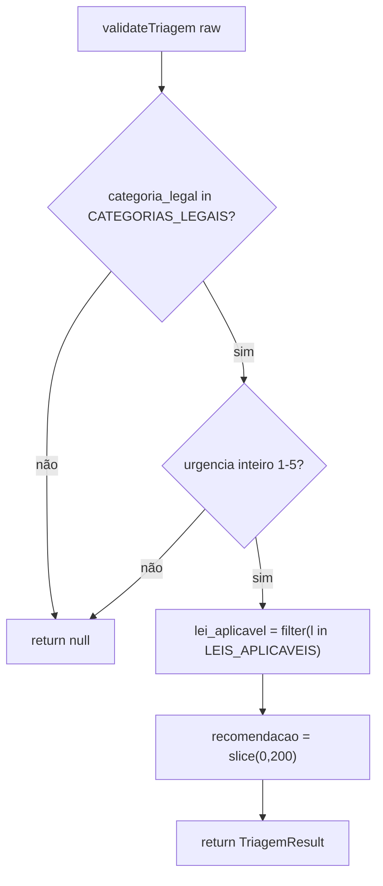

# Fluxograma — chat (núcleo do produto)

```mermaid
flowchart TD
    A[POST /api/chat] --> B{org_id e messages válidos?}
    B -- não --> B1[400]
    B -- sim --> C[orgs/org_id.get]
    C -- not exists --> C1[404]
    C -- exists --> D{unit_id informado?}
    D -- sim --> E[units/unit_id.get → unitNome]
    D -- não --> F
    E --> F[Monta systemPrompt: regras de anonimato + estilo + limite 6 trocas]
    F --> G[Abre stream Claude]
    G --> H{delta de texto?}
    H -- sim --> I[accumulated += token]
    I --> J{accumulated contém CASE_COMPLETE?}
    J -- não --> K[emite token ao cliente]
    J -- sim, ainda não criado --> L{regex casa bloco completo?}
    L -- não --> M[aguarda mais deltas]
    L -- sim --> N[parse JSON do payload]
    N -- falha --> N1[emite error, NÃO cria caso]
    N -- sucesso --> O[createCase: batch case+messages+audit]
    O --> P[emite case_created protocolo]
    P --> Q[runTriagem em background do stream]
    Q --> R[emite done]
    K --> H
    H -- stream terminou --> R
```

## runTriagem (src/lib/triagem.ts)

```mermaid
flowchart TD
    A[runTriagem caseId orgId planoAtivo coleta protocolo] --> B{planoAtivo == entrada?}
    B -- sim --> C["update case: triagem_manual=true"]
    C --> D[audit: triagem_manual_indicada]
    D --> Z[fim]
    B -- não --> E[callClaude coleta]
    E --> F{attempt <= 2 e sucesso de parse+validação?}
    F -- não após 2 tentativas --> G["update case: triagem_ia.needs_manual_review=true"]
    G --> H[audit: triagem_ia_falhou]
    H --> Z
    F -- sim --> I["update case: triagem_ia = resultado validado"]
    I --> J{urgencia >= 4?}
    J -- sim --> K[cria notifications doc: alerta_urgencia]
    J -- não --> L
    K --> L[audit: triagem_ia_concluida]
    L --> Z
```

## validateTriagem (whitelist estrita)

```mermaid
flowchart TD
    A[validateTriagem raw] --> B{categoria_legal in CATEGORIAS_LEGAIS?}
    B -- não --> Z[return null]
    B -- sim --> C{urgencia inteiro 1-5?}
    C -- não --> Z
    C -- sim --> D["lei_aplicavel = filter(l in LEIS_APLICAVEIS)"]
    D --> E["recomendacao = slice(0,200)"]
    E --> F[return TriagemResult]
```
