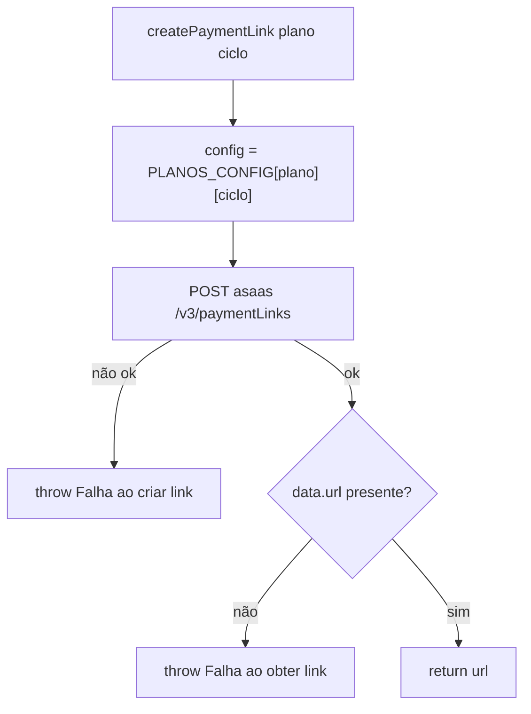

# Fluxograma — checkout

```mermaid
flowchart TD
    A[POST /api/checkout/create] --> B{plano válido? entrada|gestao}
    B -- não --> B1[400]
    B -- sim --> C{ciclo válido? mensal|anual}
    C -- não --> C1[400]
    C -- sim/omitido --> D["ciclo = ciclo ?? mensal"]
    D --> E[createPaymentLink plano ciclo]
    E -- ASAAS_API_KEY ausente --> F1[503]
    E -- falha na Asaas --> F2[502]
    E -- sucesso --> G[200 url]
    E -- erro inesperado --> F3[500]
```

## createPaymentLink


