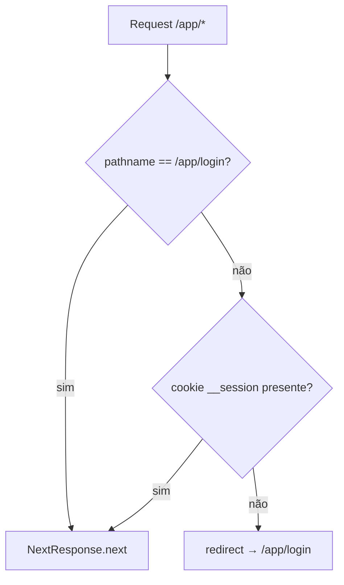
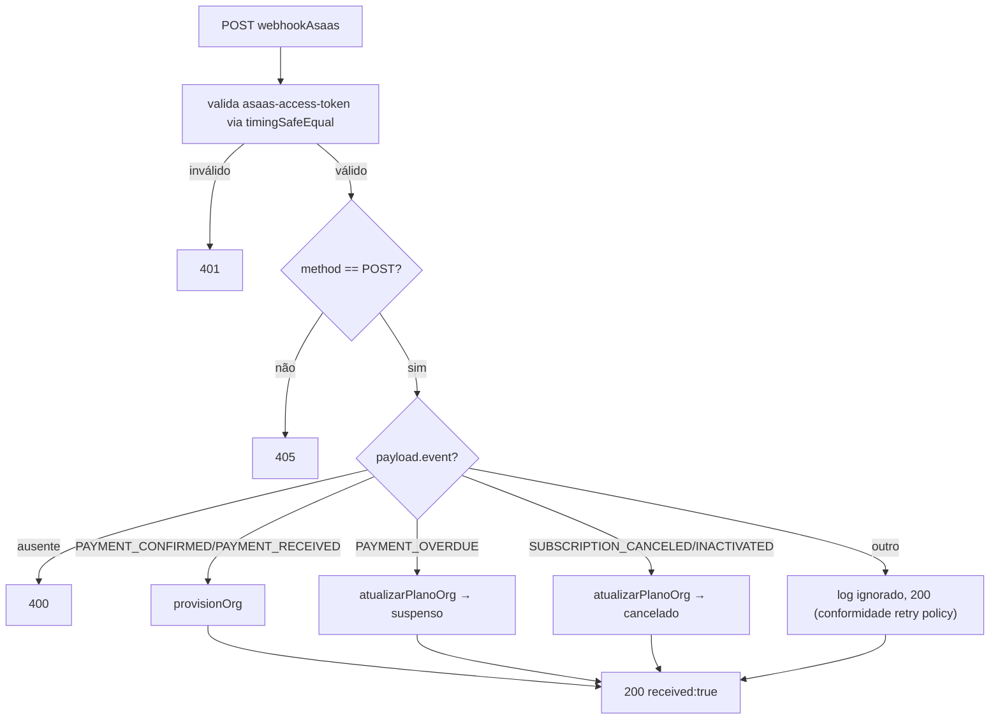
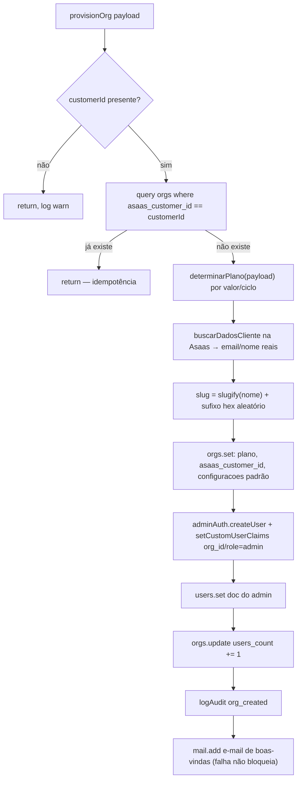
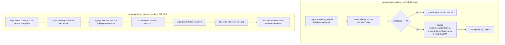

# Fluxograma — cross-cutting (infra transversal)

## Middleware de proteção de rotas

🟡 Nota: o middleware só checa **presença** do cookie, não validade — a validação real (`verifySession`) acontece em cada Route Handler.

## webhookAsaas — roteamento de eventos

## provisionOrg (idempotente)

## Scheduled functions

