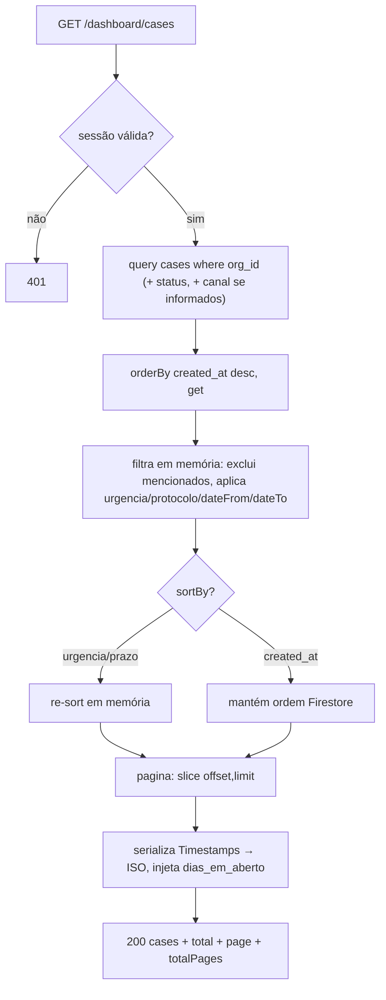
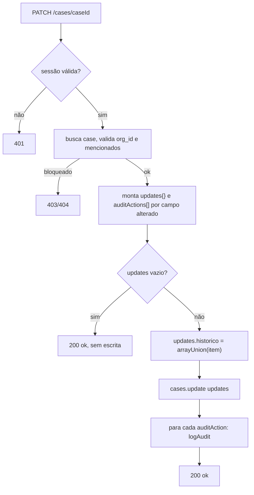
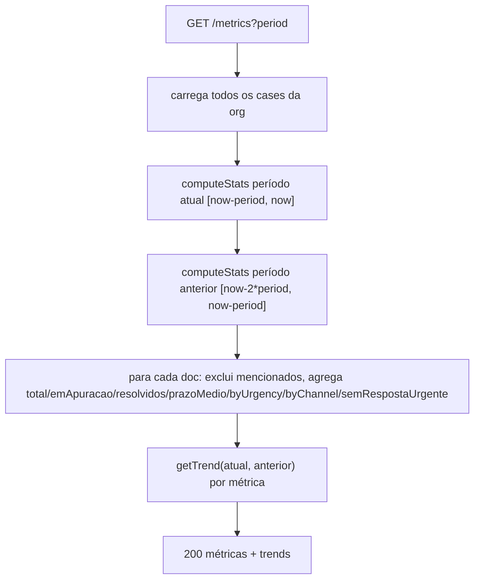
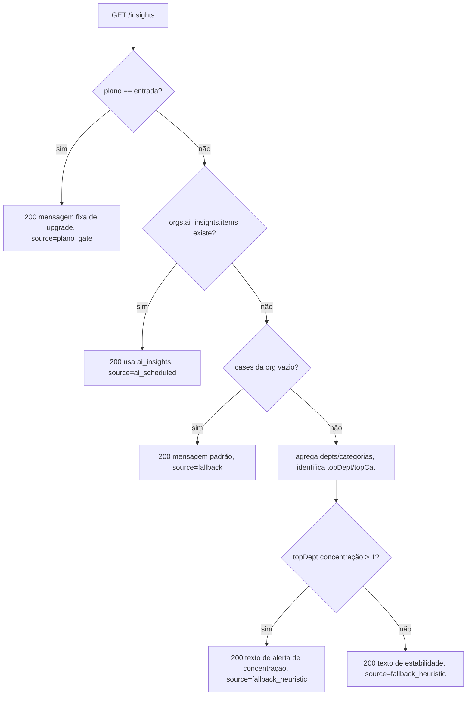

# Fluxograma — dashboard

## GET /api/dashboard/cases (listagem com filtros)



## PATCH /api/dashboard/cases/[caseId]



## GET /api/dashboard/metrics (computeStats)



## GET /api/dashboard/insights (fallback em cascata)



## POST /api/dashboard/users (criação com limite de plano)

```mermaid
flowchart TD
    A[POST /users] --> B{sessão admin?}
    B -- não --> B1[401/403]
    B -- sim --> C{email/nome/role válidos?}
    C -- não --> C1[400]
    C -- sim --> D["orgs.get → planLimit = PLAN_USER_LIMITS[plano]"]
    D --> E{users_count >= planLimit?}
    E -- sim --> E1[403 user_limit_reached]
    E -- não --> F[adminAuth.createUser]
    F --> G[users.doc(uid).set]
    G --> H["orgs.update users_count += 1"]
    H --> I[logAudit user_criado]
    I --> J[201 ok]
```
