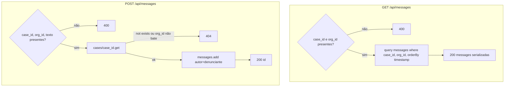

# Fluxograma — messages

```mermaid
flowchart TD
    subgraph GET[GET /api/messages]
        A1{case_id e org_id presentes?} -- não --> A2[400]
        A1 -- sim --> A3["query messages where case_id, org_id, orderBy timestamp"]
        A3 --> A4[200 messages serializadas]
    end

    subgraph POST[POST /api/messages]
        B1{case_id, org_id, texto presentes?} -- não --> B2[400]
        B1 -- sim --> B3[cases/case_id.get]
        B3 -- not exists ou org_id não bate --> B4[404]
        B3 -- ok --> B5["messages.add autor=denunciante"]
        B5 --> B6[200 id]
    end
```
