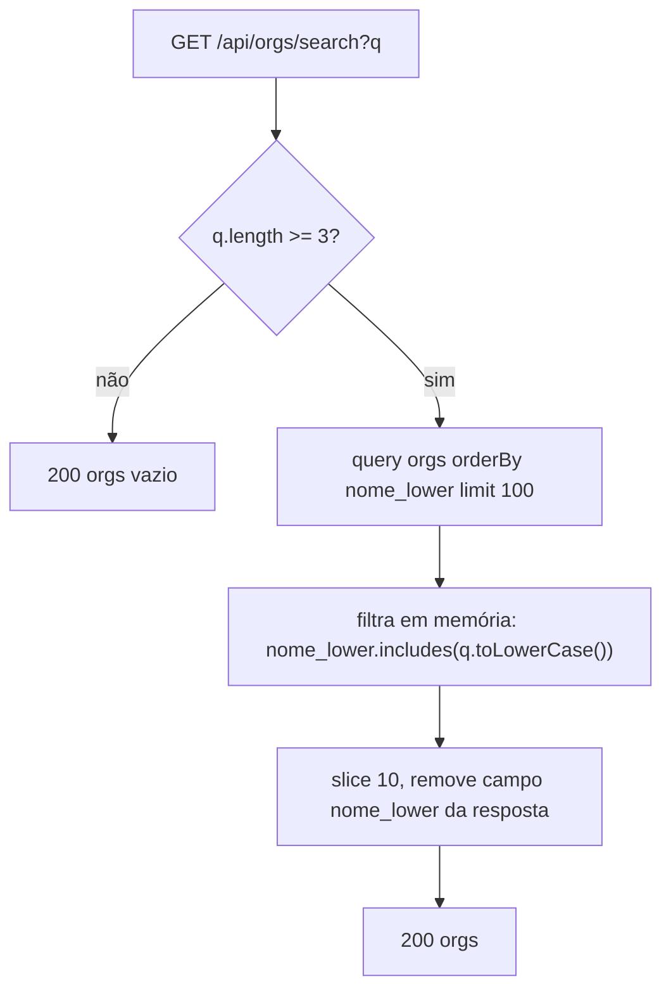

# Fluxograma — orgs

```mermaid
flowchart TD
    A[GET /api/orgs/search?q] --> B{q.length >= 3?}
    B -- não --> B1[200 orgs vazio]
    B -- sim --> C["query orgs orderBy nome_lower limit 100"]
    C --> D["filtra em memória: nome_lower.includes(q.toLowerCase())"]
    D --> E["slice 10, remove campo nome_lower da resposta"]
    E --> F[200 orgs]
```
