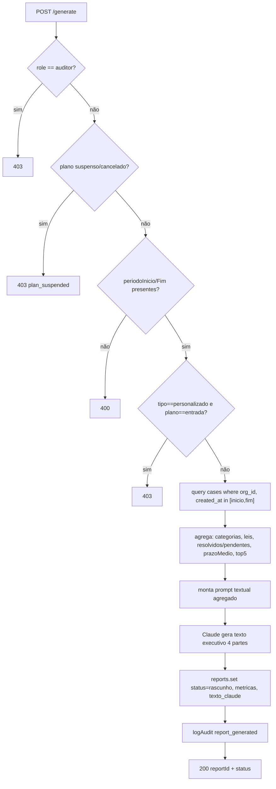
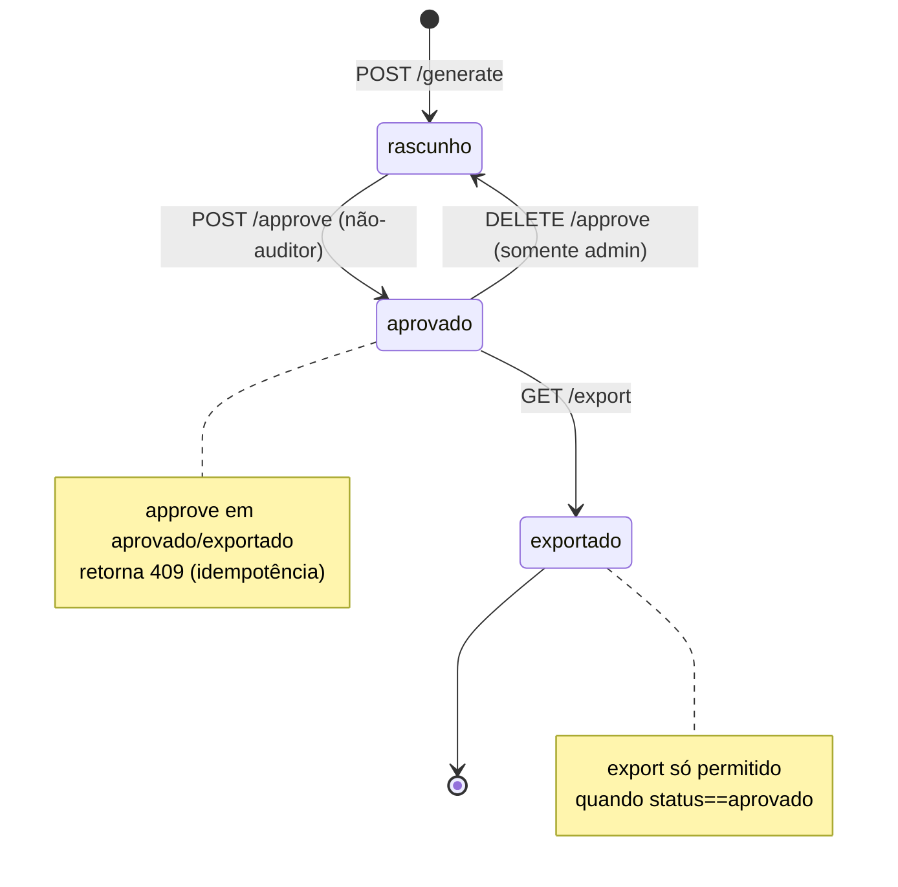
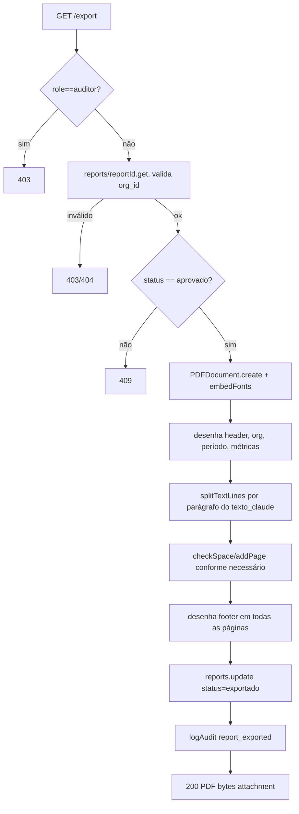

# Fluxograma — reports

## POST /api/reports/generate

```mermaid
flowchart TD
    A[POST /generate] --> B{role == auditor?}
    B -- sim --> B1[403]
    B -- não --> C{plano suspenso/cancelado?}
    C -- sim --> C1[403 plan_suspended]
    C -- não --> D{periodoInicio/Fim presentes?}
    D -- não --> D1[400]
    D -- sim --> E{tipo==personalizado e plano==entrada?}
    E -- sim --> E1[403]
    E -- não --> F["query cases where org_id, created_at in [inicio,fim]"]
    F --> G["agrega: categorias, leis, resolvidos/pendentes, prazoMedio, top5"]
    G --> H[monta prompt textual agregado]
    H --> I[Claude gera texto executivo 4 partes]
    I --> J["reports.set status=rascunho, metricas, texto_claude"]
    J --> K[logAudit report_generated]
    K --> L[200 reportId + status]
```

## Máquina de estados do Report

```mermaid
stateDiagram-v2
    [*] --> rascunho: POST /generate
    rascunho --> aprovado: POST /approve (não-auditor)
    aprovado --> rascunho: DELETE /approve (somente admin)
    aprovado --> exportado: GET /export
    exportado --> [*]
    note right of aprovado
      approve em aprovado/exportado
      retorna 409 (idempotência)
    end note
    note right of exportado
      export só permitido
      quando status==aprovado
    end note
```

## GET /api/reports/[reportId]/export (geração de PDF)

```mermaid
flowchart TD
    A[GET /export] --> B{role==auditor?}
    B -- sim --> B1[403]
    B -- não --> C[reports/reportId.get, valida org_id]
    C -- inválido --> C1[403/404]
    C -- ok --> D{status == aprovado?}
    D -- não --> D1[409]
    D -- sim --> E[PDFDocument.create + embedFonts]
    E --> F[desenha header, org, período, métricas]
    F --> G["splitTextLines por parágrafo do texto_claude"]
    G --> H["checkSpace/addPage conforme necessário"]
    H --> I[desenha footer em todas as páginas]
    I --> J["reports.update status=exportado"]
    J --> K[logAudit report_exported]
    K --> L[200 PDF bytes attachment]
```
