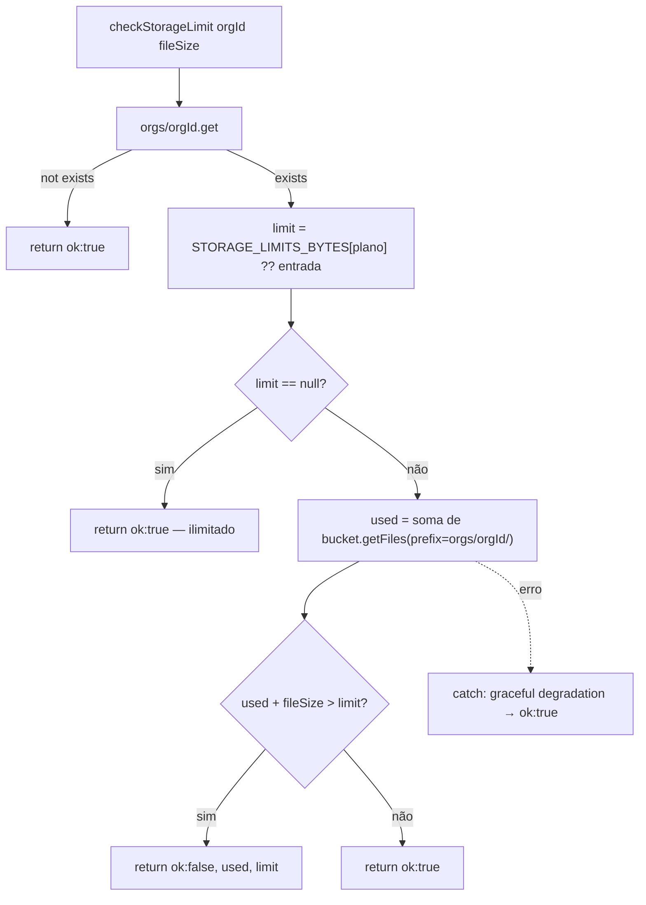

# Fluxograma — upload-attachment

```mermaid
flowchart TD
    A[POST /api/upload-attachment] --> B{file e org_id presentes?}
    B -- não --> B1[400]
    B -- sim --> C{file.size > 50MB?}
    C -- sim --> C1[400 Arquivo muito grande]
    C -- não --> D[checkStorageLimit org_id, file.size]
    D -- ok:false --> D1[403 storage_limit_exceeded]
    D -- ok:true ou falha graceful --> E[lê bytes → buffer]
    E --> F["fileTypeFromBuffer(buffer) — detecta mime real por magic bytes"]
    F --> G{mime em ALLOWED_MIME_TYPES?}
    G -- não --> H["audit: upload_rejeitado"]
    H --> H1[400 Tipo não permitido]
    G -- sim --> I["gera uuid + ext detectado → safeFilename"]
    I --> J["storage_path = orgs/orgId/cases/temp/uuid/safeFilename"]
    J --> K[bucket.file(path).save(buffer, contentType)]
    K --> L["audit: upload_aceito"]
    L --> M[200 storage_path + filename + mime_type + size]
```

## checkStorageLimit


