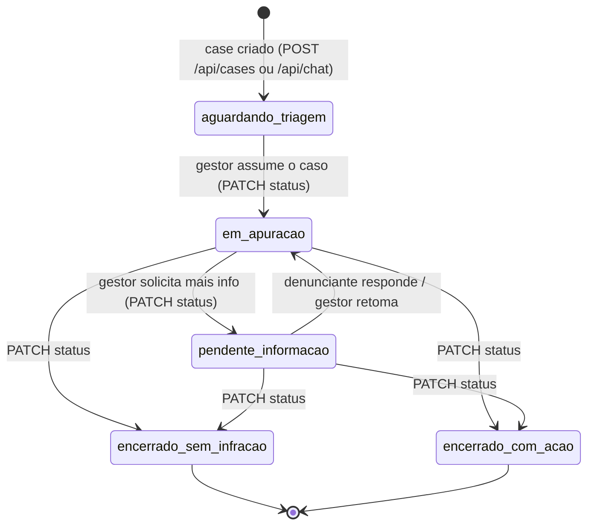
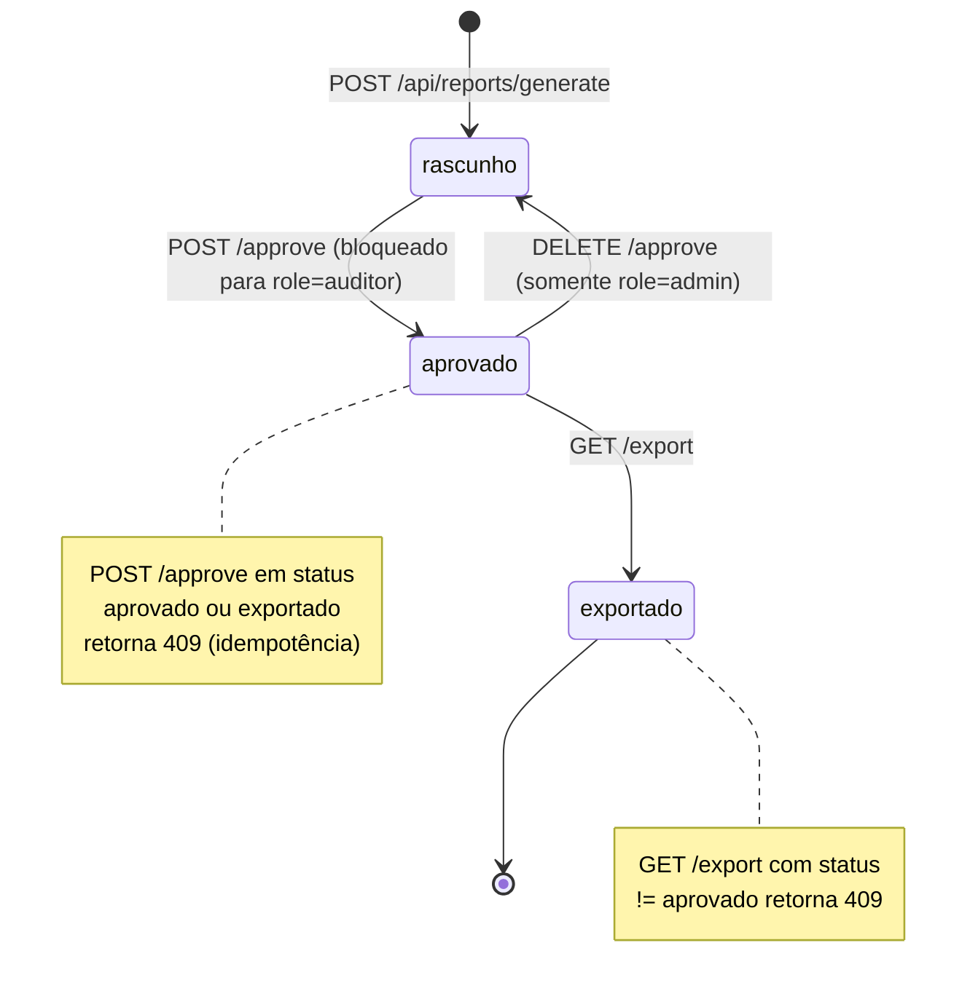
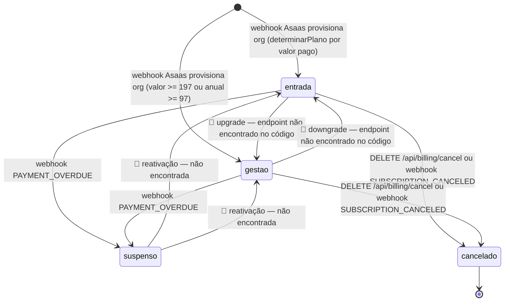
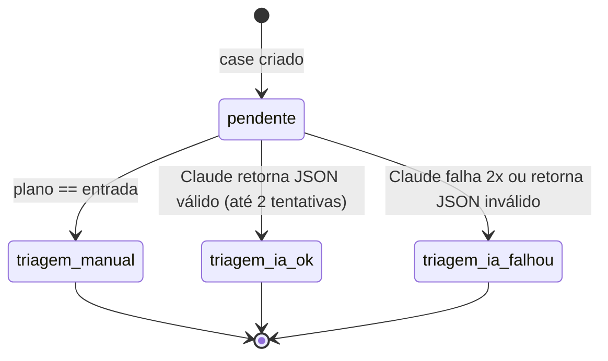

# Máquinas de Estado — portal-sigilo

> Gerado pelo Detective em 2026-07-20. Escala: 🟢 CONFIRMADO · 🟡 INFERIDO · 🔴 LACUNA

## 1. `Case.status`

🟢 Valores confirmados em `src/lib/types/index.ts` (`CaseStatus`) e uso real em `src/app/api/dashboard/cases/[caseId]/route.ts` (PATCH), `src/app/api/dashboard/metrics/route.ts` (cálculo de resolvidos).

🟡 **Transições não enforçadas no código**: `PATCH /api/dashboard/cases/[caseId]` aceita **qualquer** valor de `CaseStatus` sem validar se a transição a partir do status atual é permitida (não há máquina de estados explícita no servidor — é uma atualização de campo livre, não uma transição guardada). O diagrama acima é a transição **esperada pelo domínio**, inferida a partir dos nomes e do uso em métricas (`resolvidos` = union de `encerrado_sem_infracao`/`encerrado_com_acao`), não uma regra imposta pelo código.

🔴 **LACUNA**: não há validação server-side impedindo, por exemplo, reabrir um caso `encerrado_com_acao` de volta para `em_apuracao`, nem impedindo pular direto de `aguardando_triagem` para `encerrado_com_acao`. Se isso for indesejado no negócio real, é uma regra que falta implementar.

Toda transição de `status` gera:
- Item em `historico` via `FieldValue.arrayUnion` (append-only)
- Audit log `case_status_changed` com `detalhes: {from, to}`

## 2. `Report.status`

🟢 Única máquina de estado com transições **efetivamente guardadas** no código (`src/app/api/reports/[reportId]/approve/route.ts`, `.../export/route.ts`).

Guardas confirmadas:
- `rascunho → aprovado`: role ≠ `auditor`; se já `aprovado`/`exportado`, 409
- `aprovado → rascunho`: role === `admin` apenas
- `aprovado → exportado`: só permitido com `status === "aprovado"` (senão 409); role ≠ `auditor`
- Não existe transição `exportado → *` no código — `exportado` é terminal

Cada transição gera audit log dedicado: `report_generated`, `report_approved`, `report_reverted`, `report_exported`.

## 3. `Org.plano_ativo`

🟡 Não modelado como enum fechado em `types/index.ts` (`Plano` só declara `entrada`/`gestao`/`enterprise`), mas o comportamento em runtime revela uma máquina de estados implícita com 5 estados efetivos.

🔴 **LACUNA relevante**: as stories do Epic 9 (9.7-9.11, `docs/stories/`) mencionam "Alterar Plano" / "CTA Alterar Plano" nos títulos, e `docs/stories/9.6.alterar-plano-upgrade-downgrade.story.md` existe — mas nenhuma rota de API para upgrade/downgrade de plano foi encontrada em `src/app/api/`. Ou (a) o endpoint existe em outro nome não coberto pela varredura do Scout, ou (b) a story 9.6 ainda não foi implementada em código apesar de ter arquivo de story. Requer validação humana — ver também `_reversa_sdd/domain.md` sobre o TODO de "desativação do canal".

🟡 **Reativação de plano suspenso**: nenhuma rota trata a transição `suspenso → ativo` explicitamente; presumivelmente ocorre via novo webhook `PAYMENT_CONFIRMED` da Asaas reativando a assinatura, mas `provisionOrg` (que trata `PAYMENT_CONFIRMED`) tem guarda de idempotência que **ignora** orgs já provisionadas (`asaas_customer_id` já existe) — ou seja, um pagamento em atraso que é quitado depois **não parece reverter `plano_ativo` de volta a `entrada`/`gestao`** no código lido. Isso é uma lacuna funcional em potencial, não só de documentação.

## 4. `Case` — sub-fluxo de triagem (não é status, mas afeta o dado)

🟢 Não é uma state machine de status, mas os campos `triagem_manual` / `triagem_ia.needs_manual_review` / `triagem_ia` (preenchido) são mutuamente exclusivos e refletem o caminho percorrido em `runTriagem`:

Este sub-fluxo nunca transiciona depois de decidido — não há retry manual de triagem observado no código.
